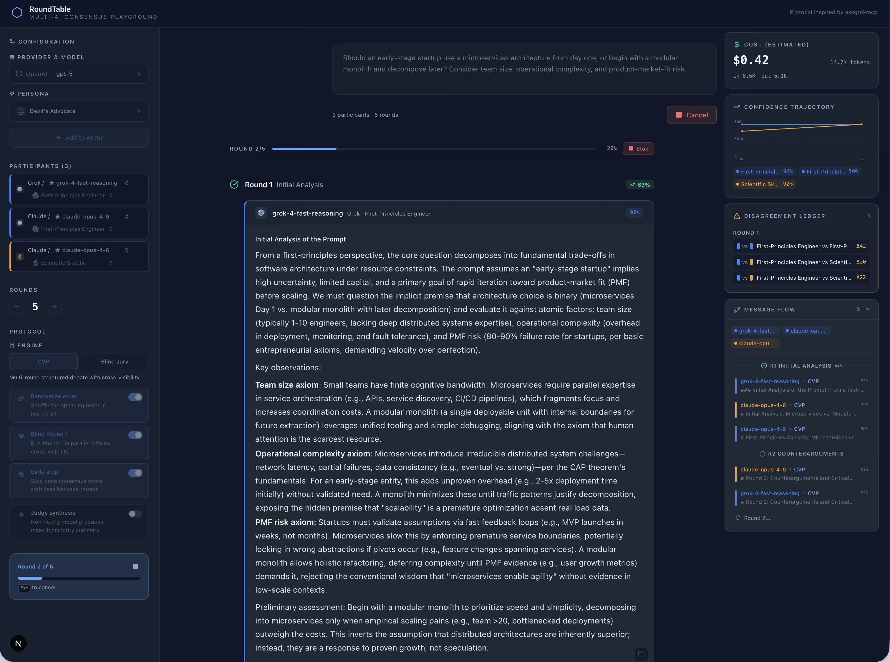

<div align="center">

> **AI Experiment / Showcase** — This project is built for educational and research purposes. It demonstrates how multiple AI models can be orchestrated into structured consensus processes. Not intended for production decision-making.

# RoundTable

### Multi-AI Consensus Playground

**Put multiple AI models in a room. Give them personas. Watch them debate.**

RoundTable runs three pluggable engines — the **Consensus Validation Protocol (CVP)**, a **Blind Jury**, and an **Adversarial Red Team** — across any combination of AI providers (Grok, Claude, GPT, Gemini, Mistral, and more). It ships with configurable personas, an axis-tunable **custom persona builder**, a non-voting Judge synthesizer, **claim-level disagreement extraction** with verbatim quotes per side, a live confidence trajectory chart, a confidence-spread disagreement ledger, a cost meter with **hard-abort cost cap**, an **engine sweep** that runs one prompt through all three engines side-by-side, shareable permalinks, and a premium dark interface designed for long sessions.

[](LICENSE)
[](https://vercel.com/new/clone?repository-url=https://github.com/entropyvortex/roundtable)
[](https://www.typescriptlang.org/)
[](https://nextjs.org/)

</div>

---

## What is RoundTable?

RoundTable is an open-source web application that orchestrates structured multi-round debates between AI models. Instead of asking one model and hoping for the best, RoundTable forces multiple models to:

1. **Analyze** a topic independently
2. **Challenge** each other's reasoning
3. **Assess** the strength of evidence presented
4. **Synthesize** a final consensus position

Each model is assigned a persona (Risk Analyst, First-Principles Engineer, Devil's Advocate, etc.) that shapes how it approaches the discussion. The result is a richer, more robust analysis than any single model can produce alone.

No database. No auth. No external services. Just add your API keys and go.

---

## Consensus Validation Protocol

### Purpose

A single language model produces a single distribution over tokens. It has no mechanism to check its own reasoning against an independent perspective. The Consensus Validation Protocol (CVP) addresses this by running multiple models — each constrained to a distinct analytical persona — through a structured sequence of rounds where they must respond to each other's arguments. The goal is not to produce a "correct" answer by majority vote, but to surface disagreements, stress-test reasoning, and force each participant to update its position in light of criticism.

The result is a scored collection of final perspectives, not a merged conclusion. The human reader is the ultimate synthesizer.

### How It Works

CVP runs up to a configured number of rounds (1–10, default 5). Each round has a designated type that constrains what participants are asked to do. From Round 2 onward, participants are processed **sequentially within each round** — later participants in a round see earlier participants' responses from that same round, in addition to all responses from prior rounds. Round 1 runs in **parallel with no cross-visibility** by default (toggleable via the "Blind Round 1" option) so the first wave of analysis is not contaminated by whoever happened to answer first.

**Round phases:**

1. **Initial Analysis** (Round 1) — Each participant provides an independent analysis of the prompt, shaped by its assigned persona. With "Blind Round 1" enabled (the default) every participant answers in parallel with no visibility into any other participant. Each response must end with a self-assessed confidence score (0–100).

2. **Counterarguments** (Round 2) — Each participant reviews all Round 1 responses and identifies weaknesses, challenges assumptions, and highlights logical gaps. Confidence scores are updated.

3. **Evidence Assessment** (Round 3) — Participants evaluate the strength of evidence presented so far, distinguish well-supported claims from speculation, and identify areas of emerging agreement.

4. **Synthesis** (Rounds 4 through N) — Participants synthesize the discussion, acknowledge remaining uncertainties, and refine their positions. The final round is labeled "Final Synthesis" in the prompt, signaling participants to commit to a concluding position.

**Randomised order.** From Round 2 onward, participant order is shuffled per round by default to prevent the first-mover from disproportionately framing each round. Toggleable via the "Randomize order" option.

**Early stopping.** When the consensus score delta between two consecutive rounds drops to ≤ 3 points, the engine emits an `early-stop` event and terminates the run before exhausting all configured rounds. This is on by default and saves cost on runs that converge quickly. Toggleable via the "Early stop" option.

**Persona injection:** Each participant's system prompt is prepended with a persona definition (e.g., "You are a Risk Analyst. Your role is to surface hidden dangers, tail risks, and second-order effects."). Personas are defined server-side in `lib/personas.ts` and cannot be modified by the client.

**Confidence extraction:** Every response is expected to end with `CONFIDENCE: [0-100]`. A regex extracts this value. If absent, confidence defaults to 50.

**Consensus scoring:** After each round, a consensus score is computed:

```
consensus_score = avg(confidence) - 0.5 * stddev(confidence)
```

High average confidence with low variance yields a high score. Disagreement (high variance) penalizes the score even if individual confidences are high.

**Disagreement detection:** After each round the engine scans every pair of participants. Any pair whose confidence diverges by ≥ 20 points is recorded in the disagreement ledger and surfaced live in the UI. The detection is intentionally deterministic and cheap — no extra LLM calls — which makes it robust to rate limits and reproducible across runs.

**Judge synthesis (optional):** When "Judge synthesis" is enabled, a dedicated non-voting model reads every participant's final-round response and produces a structured synthesis with four sections: **Majority Position**, **Minority Positions**, **Unresolved Disputes**, and **Synthesis Confidence**. The judge is forbidden from picking a winner or collapsing conditional minority views into the majority. Its output streams live to the UI and is included in all exports.

**Cost meter.** Every call is attributed to a participant and priced against the client-side table in `lib/pricing.ts`. The live meter shows total tokens (in/out) and estimated USD; totals include the judge. When the Vercel AI SDK reports token usage, the meter uses it directly; otherwise it falls back to a 4-chars-per-token heuristic.

**Provider error resilience.** When a participant's underlying provider call fails — wrong base URL, invalid API key, unknown model, upstream outage, 404 from a mismatched endpoint, you name it — the engine catches the error via the Vercel AI SDK's `onError` callback, formats it with the HTTP status code when available, logs the full error object server-side, and emits a `participant-end` event with an `error` field. The client renders that response as a red error card with the upstream message (not the usual content card), fires a toast identifying which provider/model broke, and **excludes the errored response from both the consensus score and the disagreement ledger**, so one broken provider can no longer tank the run. The remaining participants continue normally.

### Protocol Diagram

```text
User Prompt + Round Count + Participant Config
    |
    v
┌─────────────────────────────────────────────┐
│  Round 1: Initial Analysis                  │
│                                             │
│  [Persona A / Model X] ──→ Response + Conf  │
│  [Persona B / Model Y] ──→ Response + Conf  │  (sequential; B sees A's response)
│  [Persona C / Model Z] ──→ Response + Conf  │  (C sees A's and B's responses)
│                                             │
│  consensus_score = avg(conf) - 0.5*std(conf)│
└─────────────────────┬───────────────────────┘
                      │ all responses passed forward
                      v
┌─────────────────────────────────────────────┐
│  Round 2: Counterarguments                  │
│                                             │
│  Each participant receives ALL prior round  │
│  responses and must challenge assumptions.  │
│  Updated confidence scores.                 │
└─────────────────────┬───────────────────────┘
                      │
                      v
┌─────────────────────────────────────────────┐
│  Round 3: Evidence Assessment               │
│                                             │
│  Evaluate evidence quality.                 │
│  Distinguish supported claims from          │
│  speculation. Updated confidence scores.    │
└─────────────────────┬───────────────────────┘
                      │
                      v
┌─────────────────────────────────────────────┐
│  Rounds 4–N: Synthesis                      │
│                                             │
│  Refine positions. Final round prompts for  │
│  a concluding stance. Final confidence.     │
└─────────────────────┬───────────────────────┘
                      │
                      v
┌─────────────────────────────────────────────┐
│  Output                                     │
│                                             │
│  Final consensus score (last round only)    │
│  All individual final-round responses       │
│  Per-participant confidence trajectories    │
│  No auto-merged conclusion — human reviews  │
└─────────────────────────────────────────────┘
```

### Blind Jury Engine (alternative)

RoundTable also ships a **Blind Jury** engine alongside CVP. Where CVP is a multi-round debate, Blind Jury is a single-pass evaluation:

1. Every participant answers the same prompt **in parallel**, with no cross-visibility into any other answer.
2. A judge model synthesizes majority, minority, and unresolved positions from the independent responses.
3. A disagreement ledger is computed from the pairwise confidence spread, exactly as in CVP.

Blind Jury is the right engine when you want _independent_ signals rather than a negotiated consensus. Because there is no sequential visibility, it is immune to the anchoring bias that CVP needs randomized order and blind Round 1 to mitigate. It is also cheap: one API call per participant, plus one for the judge.

Switch engines from the sidebar ("Protocol" section). The Blind Jury engine ignores the round count and the CVP-specific toggles.

### Adversarial Red Team Engine (alternative)

The third engine pressure-tests positions before producing a final synthesis. Where CVP rewards consensus and Blind Jury rewards independent signal, Red Team rewards _robustness_ — every claim has to survive a hostile probe before it gets credit.

1. **Round 1 — Initial Positions.** Every participant emits their position in parallel with no cross-visibility, warned in advance that their position will be attacked. They are asked to state load-bearing claims explicitly so they can be challenged.

2. **Rounds 2 to N-1 — Stress Tests.** One participant per round is the **attacker** (round-robin via `pickAttackerIndex(round, participantCount)`). The attacker turn is special: their persona is _suspended_ for the round and replaced with a "neutral red-team attacker" framing that demands they begin with `Attacking claim: <verbatim quote>` and surface the weakest load-bearing claim. The remaining participants are **defenders** and respond to the attack **in parallel** (same anti-anchoring philosophy as Blind Round 1) — they cannot see other defenders' replies.

3. **Round N — Post-Stress Final Synthesis.** Every participant in parallel writes their final position, explicitly acknowledging which attacks landed, which missed, and what conditional caveats they now attach.

The attacker's confidence score reports how confident they are that the attack lands — not their belief in any underlying view. This is **out-of-band** for the consensus formula, so stress-round scores and disagreement detection are computed from defender responses only, keeping the `avg − 0.5·stddev` interpretation consistent with CVP and Blind Jury.

Switch engines from the Protocol panel. Red Team uses the round count slider; minimum sensible run is 3 rounds (init + 1 stress + final).

### Engine Sweep Mode

Click **Sweep** instead of **Run Consensus** and the same prompt is run through CVP, Blind Jury, and Adversarial Red Team in sequence. The live results panel shows the currently-running engine; below it the **Sweep Results** panel renders one card per engine with the final consensus score, the judge's majority excerpt, the top contradictions, the disagreement count, and the per-engine token / USD subtotal. This makes the _protocol space_ legible — you see how the same question converges (or doesn't) under three different consensus shapes.

Sweep is sequential to respect rate limits; Esc or the Cancel Sweep button tears down the active run while preserving any engines that already completed. Because a sweep is roughly 3× the cost of a single run, the **cost cap** in the Protocol panel is the recommended companion control.

### Custom Persona Builder

The persona menu now includes a **Build a custom persona…** entry. Instead of free-text, the builder exposes six axes — Risk tolerance, Optimism, Evidence bar, Formality, Verbosity, Contrarian streak — each with three levels (low / mid / high). The server composes the system prompt from a small library of vetted phrase fragments, one per `(axis, level)`. The user-typed name is sanitised to a Unicode-letter / digit / space / `._-'` allowlist and capped to 32 chars; user-typed prompt text never reaches the LLM.

This preserves the existing security model: every consensus request rebuilds personas server-side from their IDs, and a custom persona's spec is re-sanitised and re-composed on every run. The spec is cached in `localStorage` so the user can iterate across sessions; it is **not** embedded in URL-hash permalinks (the spec is, the composed prompt is, but neither carries arbitrary text).

### Claim-Level Disagreement Extraction

The confidence-spread `Disagreement` ledger only catches pairs whose self-reported confidence diverges by ≥20 points. After every run with **Claim extraction** enabled (default ON), an additional LLM pass reads the final-round responses and emits a strict JSON object of `{contradictions: [{claim, sides: [{stance, participantIds, quote}]}]}`. The parser:

- Drops contradictions with empty claims, fewer than 2 sides, or sides without a quote.
- Verifies each quote against the actual response content of the named participants. If the (normalised) first 80 characters don't appear in any cited participant's text, the side is dropped — fabricated quotes don't render.
- Rejects entries where any participant id appears on more than one side.
- Caps to 8 contradictions per run.

The result renders in the **Claim-Level Contradictions** panel with one card per contradiction, a colored stripe per side, the stance label, the participants involved, and the verbatim quote. Click a side to scroll to that participant's final-round response. If the extractor itself fails (provider error, model unavailable), a distinct red error card explains what happened — the run is unaffected.

The extractor reuses the judge model when judge synthesis is enabled (single user choice, no extra picker); otherwise it falls back to the first participant's model.

### Cost Cap

A numeric "Cost cap" input in the Protocol panel hard-aborts the run if the running estimated cost crosses the threshold. The engine accumulates `runningCostUSD` after every round, judge call, and claim-extraction call; on cross, it throws `CostCapExceededError` which the SSE pipeline surfaces as an `error` event. The cap is server-clamped to ≤ $50.

### Why This Is Better Than Majority Vote

Majority vote asks N models the same question and picks the most common answer. CVP does something structurally different:

- **Persona diversity forces coverage.** A Risk Analyst and an Optimistic Futurist will examine different failure modes and opportunities from the same prompt. This isn't random variation — it's directed exploration of the problem space.

- **Sequential visibility creates dialogue.** Because participants within a round see earlier responses, later participants can directly respond to specific claims. This is closer to a structured debate than independent polling.

- **Multi-round iteration forces updating.** A model that states high confidence in Round 1 must confront counterarguments in Round 2 and defend or revise in subsequent rounds. The protocol mechanically prevents "fire and forget" responses.

- **Confidence variance detects real disagreement.** The consensus score penalizes high-confidence disagreement. If three models each claim 95% confidence but on different conclusions, the score drops. This surfaces cases where naive voting would mask genuine uncertainty.

- **The human sees everything.** CVP does not collapse the debate into a single answer. All intermediate reasoning is visible, streamed in real-time. The reader can trace exactly where participants agreed, where they diverged, and why.

### Failure Modes

**Shared hallucinations.** If all underlying models share the same training-data blind spot, personas will not fix it. A Risk Analyst running on GPT-4o and a Scientific Skeptic running on GPT-4o share the same parametric knowledge. Cross-provider diversity (e.g., mixing Grok, Claude, and Gemini) partially mitigates this, but cannot eliminate it.

**Prompt bias propagation.** The user's prompt frames the debate. If the prompt contains a false premise, all participants may accept it. Personas like First-Principles Engineer and Scientific Skeptic are designed to push back, but their effectiveness depends on the model's ability to detect the bias.

**Sycophantic convergence.** Models still tend to agree with prior responses, especially in later rounds. "Blind Round 1" and "Randomize order" reduce this bias but do not eliminate it — the last participant of any sequential round still sees the most prior context and may anchor to the emerging consensus rather than independently evaluating. Blind Jury avoids this failure mode entirely at the cost of giving up multi-round refinement.

**Cost scales linearly.** Each participant makes one API call per round. With 4 participants and 5 rounds, that is 20 API calls per consensus run, plus one for the judge if enabled. At 1,500 tokens per response, a single run can consume 30,000+ output tokens across providers. Early stopping and Blind Jury are the easiest levers to lower cost; the live cost meter in the floating run panel makes this concrete during a run.

**Confidence scores are self-reported.** Models assign their own confidence. There is no calibration, no ground truth, and no penalty for overconfidence. The consensus score is only as meaningful as the models' ability to self-assess — which is known to be unreliable. The judge synthesizer is deliberately _not_ a calibrator: it summarises what was said, it does not grade it.

**Disagreement heuristic is confidence-based.** The default disagreement ledger flags pairs whose confidence diverges by ≥ 20 points. This catches loud splits but misses cases where two participants hold opposite positions with identical confidence. The **claim-level extractor** addresses this gap by running an additional LLM pass that emits structured contradictions with verbatim quotes per side; quotes are verified against actual response content so fabricated claims are dropped. The confidence-spread ledger remains as a fast, deterministic, no-extra-LLM-call lower bound.

### Example Transcript

This is a simplified reconstruction of how a 3-participant, 3-round run behaves based on the actual code path. The prompt is: _"Should a startup use microservices from day one?"_

**Round 1 — Initial Analysis:**

> **Risk Analyst (Grok):** Microservices introduce distributed systems complexity — network partitions, eventual consistency, deployment orchestration — before the team has validated product-market fit. Premature optimization of architecture is a top-5 startup killer. CONFIDENCE: 85

> **Optimistic Futurist (Claude):** Starting with microservices positions the team for scale from day one. The tooling has matured — Kubernetes, service meshes, and managed cloud services reduce the operational burden significantly. CONFIDENCE: 75

> **First-Principles Engineer (GPT-4o):** The question conflates architecture with deployment strategy. A modular monolith can be decomposed later. The real constraint is team size — a 3-person team cannot operate 8 services. CONFIDENCE: 90

_Consensus score: 80 (avg=83.3, stddev=6.2)_

**Round 2 — Counterarguments:**

> **Risk Analyst:** The Optimistic Futurist overstates tooling maturity. Kubernetes is not "reduced complexity" — it's traded complexity. Agree with First-Principles on the team-size constraint. Revising slightly upward. CONFIDENCE: 88

> **Optimistic Futurist:** The First-Principles argument about modular monoliths is valid. However, decomposing a monolith later is not free — the argument assumes clean module boundaries that rarely exist in practice. Lowering confidence. CONFIDENCE: 65

> **First-Principles Engineer:** Risk Analyst's point about premature optimization aligns with my position. The Futurist raises a fair concern about decomposition cost, but this is solvable with discipline. Maintaining position. CONFIDENCE: 88

_Consensus score: 77 (avg=80.3, stddev=10.7 — variance increased due to Futurist's drop)_

**Round 3 — Evidence Assessment / Final Synthesis:**

> **Risk Analyst:** The evidence pattern across rounds: 2/3 participants favor monolith-first. The Futurist's tooling argument was partially conceded. Remaining disagreement is about decomposition cost — a real but secondary concern. CONFIDENCE: 90

> **Optimistic Futurist:** I concede the monolith-first approach is lower-risk for most startups. My position narrows to: startups with **known scale requirements** (e.g., real-time data pipelines) may justify early microservices. CONFIDENCE: 70

> **First-Principles Engineer:** Consensus is forming around monolith-first with clean boundaries. The Futurist's exception for known-scale cases is reasonable and worth noting. CONFIDENCE: 92

_Final consensus score: 81 (avg=84, stddev=9.8)_

The human reader sees three final positions that largely converge but preserve the Futurist's conditional exception — something a majority vote would have discarded.

### Still Open

The following are deliberate non-goals for v1 but would further tighten the protocol:

1. **Confidence calibration or external validation.** Self-reported confidence is unreliable. A calibration step — comparing stated confidence to accuracy on known-answer questions — or a separate judge model that _grades_ argument quality (as opposed to the current faithfulness-only synthesizer) would add grounding.

2. **Additional pluggable engines.** Adversarial Red Team is available; Delphi, Ranked Choice, and Dialectical variants are still on the Roadmap. The engine interface is clean enough that adding a new one is one new function plus a dispatcher branch.

3. **Cross-engine judge synthesis.** Engine sweep currently runs an independent judge per engine. A meta-judge that synthesises across all three engines' final rounds would surface "what every protocol agrees on" but is deferred — per-engine judges produce intentionally engine-specific outputs (e.g. CVP's "Majority Position" is semantically different from Adversarial's post-stress majority).

## Security

This is an experimental research demo with **no authentication**. Anyone who can reach the URL can spend your provider keys. Read [SECURITY.md](SECURITY.md) before deploying.

The codebase has been built with defense-in-depth in mind — server-side persona rebuilds (the client cannot inject a `systemPrompt`), an axis-only custom-persona builder (no user free-text reaches the LLM), per-IP rate limiting, server-side input validation, an optional cost cap that hard-aborts a run when the running estimate crosses a USD threshold, and a strict claim-extractor parser that rejects fabricated quotes. Details and threat model in [SECURITY.md](SECURITY.md).

---

## Screenshot



## Features

| Feature                              | Description                                                                                                                                                                                                                                                                                           |
| ------------------------------------ | ----------------------------------------------------------------------------------------------------------------------------------------------------------------------------------------------------------------------------------------------------------------------------------------------------- |
| **Multi-Provider**                   | Connect any OpenAI-compatible API — Grok, Claude, OpenAI, Mistral, Groq, Together, and more                                                                                                                                                                                                           |
| **Three Engines**                    | **CVP** (multi-round debate), **Blind Jury** (parallel independent responses + judge synthesis), and **Adversarial Red Team** (rotating attacker stress-tests positions before a post-stress synthesis) — switch from the Protocol panel                                                              |
| **Engine Sweep Mode**                | One click runs the same prompt through all three engines sequentially and renders side-by-side cards so you can _see_ how the protocol shape changes the conclusion                                                                                                                                   |
| **7 Built-in Personas**              | Risk Analyst, First-Principles Engineer, VC Specialist, Scientific Skeptic, Optimistic Futurist, Devil's Advocate, Domain Expert                                                                                                                                                                      |
| **Custom Persona Builder**           | Build session-scoped personas by tuning six axes (risk tolerance, optimism, evidence bar, formality, verbosity, contrarian streak) — server composes the prompt from vetted phrase fragments, no user free-text reaches the LLM, no jailbreak surface                                                 |
| **Blind Round 1**                    | CVP's first round runs in parallel with zero cross-visibility so the first wave of analysis is not contaminated by speaking order                                                                                                                                                                     |
| **Randomized Order**                 | CVP shuffles participant order in rounds 2+ to kill first-mover anchoring bias                                                                                                                                                                                                                        |
| **Early Stopping**                   | CVP detects convergence between rounds and terminates early, saving latency and tokens                                                                                                                                                                                                                |
| **Judge Synthesizer**                | Optional non-voting model that produces a structured **Majority / Minority / Unresolved / Confidence** summary over the final-round answers                                                                                                                                                           |
| **Claim-Level Disagreement Extractor** | LLM pass after the final round emits structured `{claim, sides[{stance, participants, verbatim quote}]}`. Quotes are verified against actual response content (fabricated quotes are dropped); same-participant-on-multiple-sides is rejected. Click a side to jump to that participant's response  |
| **Confidence Trajectory Chart**      | Live sparkline with one line per participant, so you can _see_ drift, convergence, and sycophancy as the run unfolds                                                                                                                                                                                  |
| **Disagreement Ledger**              | Deterministic confidence-spread detector grouping flagged pairs by round — click a row to jump to that round in the transcript                                                                                                                                                                        |
| **Cost Meter + Cost Cap**            | Live total tokens and estimated USD per run, with a bundled pricing table for major frontier models. Optional hard-abort cost cap (USD) tears down the run as soon as the running estimate crosses the threshold                                                                                      |
| **Floating Run Panel**               | On xl+ screens a pinned right-side container stacks the cost meter, confidence trajectory, disagreement ledger, claim contradictions, and a collapsible UML-style message flow diagram, scrolling as a unit so all of them stay in view throughout a long transcript. Below xl the panels fall back into the left sidebar |
| **Provider Error Handling**          | Errored participant calls render as red error cards with the upstream message + HTTP status, fire a per-participant toast, and are excluded from the consensus score and disagreement ledger so one broken provider can't tank a run                                                                  |
| **Prompt Library**                   | 8 curated preset prompts surfaced under the textarea for first-time visitors to hit Run immediately                                                                                                                                                                                                   |
| **Session Export & Share**           | One-click download as Markdown or JSON (includes the claim digest), plus a permalink that encodes the full run into the URL hash (compressed when available)                                                                                                                                          |
| **Shared View Mode**                 | Loading a `#rt=…` permalink rehydrates the run into a read-only viewer for review, embedding, or screenshots                                                                                                                                                                                          |
| **Real-time SSE Streaming**          | Watch responses arrive token-by-token with live progress tracking                                                                                                                                                                                                                                     |
| **Cascaded Model Selector**          | Provider-first dropdown with persona assignment per participant                                                                                                                                                                                                                                       |
| **Copy to Clipboard**                | One-click raw markdown export per response                                                                                                                                                                                                                                                            |
| **Cancel Anytime**                   | Stop button + Escape key — single-engine cancels the current run; sweep mode cancels the entire sweep while preserving any engines that already completed                                                                                                                                             |
| **Premium Dark UI**                  | High-contrast, readable interface designed for extended analysis sessions                                                                                                                                                                                                                             |
| **Rate-Limited API**                 | In-memory per-IP rate limiting, server-side input validation, persona/model re-verification                                                                                                                                                                                                           |
| **No External Services**             | No database, no auth service, no persistence — Vercel-deployable in one click                                                                                                                                                                                                                         |

---

## Quick Start

```bash
git clone https://github.com/entropyvortex/roundtable.git
cd roundtable
pnpm install
```

Copy the example environment file and add your API keys:

```bash
cp .env.example .env.local
```

Edit `.env.local` with your keys, then:

```bash
pnpm dev
```

Open [http://localhost:3000](http://localhost:3000). Add participants from the left sidebar (pick a built-in persona or build a custom one with the axis sliders), choose an engine in the **Protocol** panel (CVP, Blind Jury, or Adversarial Red Team), optionally enable judge synthesis and claim-level extraction, set a **cost cap** if you want hard-abort protection, type a prompt (or click a preset), and hit **Run Consensus** — or hit **Sweep** to run the same prompt through all three engines back-to-back. On xl+ screens the cost meter, confidence trajectory, disagreement ledger, claim contradictions, and message-flow diagram live in a floating panel pinned to the right of the viewport — watch them populate in real time as the debate streams. Below xl those same panels fall back into the left sidebar. When the run finishes, click **Export** in the results panel to download the transcript as Markdown/JSON or copy a permalink that rehydrates the run on any browser.

---

## Configuration

RoundTable uses a single `AI_PROVIDERS` environment variable containing a JSON array. Each provider specifies a base URL, API key reference, and available models.

### Provider Format

```json
[
  {
    "id": "grok",
    "name": "Grok",
    "baseUrl": "https://api.x.ai/v1",
    "apiKey": "env:GROK_API_KEY",
    "models": ["grok-3", "grok-4-0709"]
  },
  {
    "id": "claude",
    "name": "Claude",
    "baseUrl": "https://api.anthropic.com/v1",
    "apiKey": "env:ANTHROPIC_API_KEY",
    "models": ["claude-sonnet-4-20250514"]
  },
  {
    "id": "openai",
    "name": "OpenAI",
    "baseUrl": "https://api.openai.com/v1",
    "apiKey": "env:OPENAI_API_KEY",
    "models": ["gpt-4o"]
  }
]
```

### API Key Resolution

The `apiKey` field supports two formats:

| Format           | Example              | Behavior                                                       |
| ---------------- | -------------------- | -------------------------------------------------------------- |
| `"env:VAR_NAME"` | `"env:GROK_API_KEY"` | Reads the value from the named environment variable at runtime |
| Literal string   | `"xai-abc123..."`    | Uses the value directly (not recommended for production)       |

API keys are resolved server-side only and never exposed to the browser. All AI calls go through Next.js API routes.

### Endpoint compatibility

All consensus calls go through the **OpenAI chat completions** endpoint (`POST /chat/completions`), not the newer OpenAI Responses API. This is deliberate: `/chat/completions` is the one endpoint every provider's OpenAI-compat shim actually implements. In code we pin this by using `provider.chat(modelId)` instead of the default `provider(modelId)` — the latter targets `/responses`, which is OpenAI-only.

That means your `baseUrl` should be the provider's base that serves `/chat/completions`:

| Provider   | Base URL                         | Notes                                                                                                                                                                   |
| ---------- | -------------------------------- | ----------------------------------------------------------------------------------------------------------------------------------------------------------------------- |
| OpenAI     | `https://api.openai.com/v1`      | Native endpoint.                                                                                                                                                        |
| Anthropic  | `https://api.anthropic.com/v1`   | Requires Anthropic's [OpenAI-SDK compatibility layer](https://docs.anthropic.com/en/api/openai-sdk). Models include `claude-sonnet-4-20250514`, `claude-opus-4-1`, etc. |
| xAI (Grok) | `https://api.x.ai/v1`            | Native OpenAI-compatible.                                                                                                                                               |
| Groq       | `https://api.groq.com/openai/v1` | Native OpenAI-compatible.                                                                                                                                               |
| Together   | `https://api.together.xyz/v1`    | Native OpenAI-compatible.                                                                                                                                               |
| Mistral    | `https://api.mistral.ai/v1`      | Native OpenAI-compatible.                                                                                                                                               |

If a provider only ships a dedicated SDK with no `/chat/completions` shim, it is not currently supported.

### Adding a New Provider

Any OpenAI-compatible API works. Add an entry to the `AI_PROVIDERS` array with the correct `baseUrl` and you're done. Examples:

```json
{
  "id": "groq",
  "name": "Groq",
  "baseUrl": "https://api.groq.com/openai/v1",
  "apiKey": "env:GROQ_API_KEY",
  "models": ["llama-3.3-70b-versatile"]
}
```

```json
{
  "id": "together",
  "name": "Together",
  "baseUrl": "https://api.together.xyz/v1",
  "apiKey": "env:TOGETHER_API_KEY",
  "models": ["meta-llama/Llama-3-70b-chat-hf"]
}
```

---

## Architecture

```
app/
  api/
    consensus/route.ts       SSE streaming endpoint — validates options & dispatches to the engine
    providers/route.ts       Returns client-safe model list (no secrets)
  page.tsx                   Main dashboard — sidebar, prompt, results, SSE processor
  layout.tsx                 Root layout with Sonner toasts
components/
  AISelector.tsx             Cascaded provider/model picker + persona selector
  ConfigPanel.tsx            Engine selector, CVP toggles, judge model picker, claim toggle, cost cap
  ResultPanel.tsx            Live streaming results, error cards, markdown rendering
  SweepResultsPanel.tsx      Side-by-side comparison cards for engine sweep results
  MessageFlowDiagram.tsx     Floating right-side panel: cost + trajectory + ledger + claims + UML flow
  ConfidenceTrajectory.tsx   SVG sparkline of per-participant confidence across rounds
  DisagreementPanel.tsx      Grouped disagreement ledger with click-to-scroll
  ClaimsPanel.tsx            Claim-level contradictions card stack with verbatim quotes
  CostMeter.tsx              Live token/USD totals
  JudgeCard.tsx              Non-voting judge synthesis output
  PersonaBuilder.tsx         Axis-slider builder for custom personas (no free-text → no jailbreak surface)
  PromptLibrary.tsx          Preset prompt chips under the textarea
  SessionMenu.tsx            Export (Markdown/JSON) + copy permalink dropdown
  BackToTop.tsx              Scroll navigation
lib/
  consensus-engine.ts        CVP + Blind Jury + Adversarial Red Team orchestration, judge, claim extractor, cost cap
  providers.ts               Server-side provider resolution (parses AI_PROVIDERS)
  personas.ts                7 participant personas + JUDGE_PERSONA + axis-based custom-persona composer
  pricing.ts                 Model pricing table + cost estimator
  prompt-library.ts          Preset prompts for the library UI
  session.ts                 Snapshot ↔ Markdown / JSON / URL-hash serializer (incl. claim digests)
  store.ts                   Zustand global state, options bundle, sweep state, snapshot load/save
  types.ts                   All TypeScript types
```

The consensus engine runs entirely server-side. Each round streams responses via Server-Sent Events. The client processes events through a single `processEvent` function that calls Zustand actions directly via `getState()` — no subscriptions, no re-renders from token events. The same event pipeline drives the confidence trajectory, the disagreement ledger, the cost meter, the judge card, and the claims panel — every panel reads from one coherent store.

---

## Tech Stack

| Layer          | Technology                                           |
| -------------- | ---------------------------------------------------- |
| Framework      | Next.js 15 (App Router, React 19)                    |
| Language       | TypeScript (strict mode)                             |
| Styling        | Tailwind CSS                                         |
| State          | Zustand (granular selectors for performance)         |
| AI Integration | Vercel AI SDK (`@ai-sdk/openai` compatible adapters) |
| Markdown       | react-markdown + remark-gfm                          |
| Icons          | lucide-react                                         |
| Toasts         | Sonner                                               |

---

## Deploy

[](https://vercel.com/new/clone?repository-url=https://github.com/entropyvortex/roundtable)

Set your environment variables (`GROK_API_KEY`, `ANTHROPIC_API_KEY`, `OPENAI_API_KEY`, `AI_PROVIDERS`) in the Vercel dashboard. No database or external services required.

---

## Adding Personas

Edit `lib/personas.ts` and add a new entry to the `PERSONAS` array:

```typescript
{
  id: "philosopher",
  name: "Philosopher",
  emoji: "...",
  color: "#a78bfa",
  description: "Examines questions through ethical and epistemological frameworks",
  systemPrompt: `You are a Philosopher. Analyze through ethics, epistemology...`,
}
```

The new persona will appear in every selector automatically.

---

## Roadmap

RoundTable ships with three engines today. The architecture is designed to support more:

| Engine                                  | Status    | Description                                                                                    |
| --------------------------------------- | --------- | ---------------------------------------------------------------------------------------------- |
| **CVP (Consensus Validation Protocol)** | Available | Multi-round structured debate with blind Round 1, randomized order, early stop, optional judge |
| **Blind Jury**                          | Available | Parallel independent responses with no cross-visibility, followed by a judge synthesis         |
| **Adversarial Red Team**                | Available | Rotating attacker stress-tests positions across stress rounds, post-stress synthesis last      |
| **Delphi Method**                       | Planned   | Anonymous multi-round forecasting with statistical aggregation between rounds                  |
| **Ranked Choice Synthesis**             | Planned   | Each model proposes solutions, then ranks all proposals — converges via elimination            |
| **Dialectical Engine**                  | Planned   | Thesis / Antithesis / Synthesis structure with formal argument mapping                         |

The consensus engine is a single file (`lib/consensus-engine.ts`) with a clean interface — contributions for new engines are welcome.

---

## Credits

RoundTable implements the **Consensus Validation Protocol** concept from [askgrokmcp](https://www.npmjs.com/package/askgrokmcp) — an MCP server that brings Grok's multi-model consensus capabilities to any AI assistant.

Built by [Marcelo Ceccon](https://github.com/marceloceccon).

---

## License

MIT License. See [LICENSE](LICENSE) for details.

---

<div align="center">

**If RoundTable is useful to you, consider giving it a star.**

It helps others discover it and motivates continued development.

</div>
