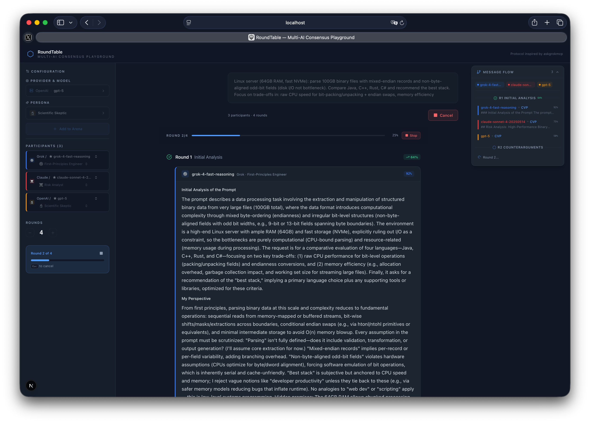
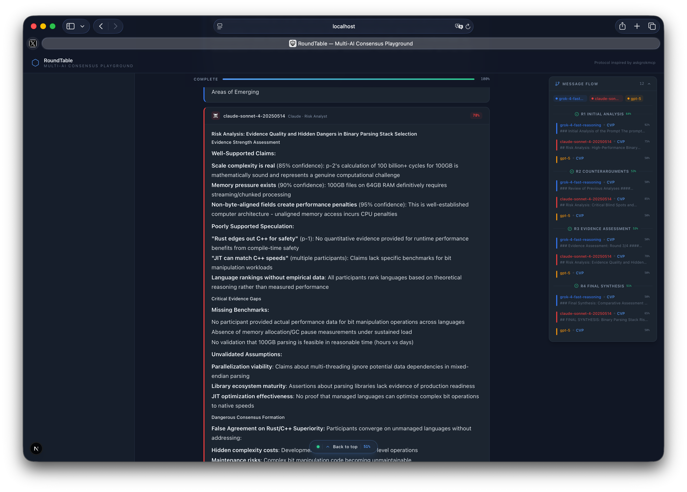

<div align="center">

> **AI Experiment / Showcase** — This project is built for educational and research purposes. It demonstrates how multiple AI models can be orchestrated into structured consensus processes. Not intended for production decision-making.

# RoundTable

### Multi-AI Consensus Playground

**Put multiple AI models in a room. Give them personas. Watch them debate.**

RoundTable runs the Consensus Validation Protocol (CVP) across any combination of AI providers — Grok, Claude, GPT, Gemini, Mistral, and more — with configurable personas, real-time streaming, and a premium dark interface designed for long sessions.

[](LICENSE)
[](https://vercel.com/new/clone?repository-url=https://github.com/marceloceccon/roundtable)
[](https://www.typescriptlang.org/)
[](https://nextjs.org/)

</div>

---

## What is RoundTable?

RoundTable is an open-source web application that orchestrates structured multi-round debates between AI models. Instead of asking one model and hoping for the best, RoundTable forces multiple models to:

1. **Analyze** a topic independently
2. **Challenge** each other's reasoning
3. **Assess** the strength of evidence presented
4. **Synthesize** a final consensus position

Each model is assigned a persona (Risk Analyst, First-Principles Engineer, Devil's Advocate, etc.) that shapes how it approaches the discussion. The result is a richer, more robust analysis than any single model can produce alone.

No database. No auth. No external services. Just add your API keys and go.

## Security

This is experimental, it has no authentication protection, if you publish this with your keys, someone could burn your tokens/exploit to process their prompts out of curiosity or malice.

---

## Screenshots



## 

## Features

| Feature                           | Description                                                                                                                      |
| --------------------------------- | -------------------------------------------------------------------------------------------------------------------------------- |
| **Multi-Provider**                | Connect any OpenAI-compatible API — Grok, Claude, OpenAI, Mistral, Groq, Together, and more                                      |
| **7 Built-in Personas**           | Risk Analyst, First-Principles Engineer, VC Specialist, Scientific Skeptic, Optimistic Futurist, Devil's Advocate, Domain Expert |
| **Consensus Validation Protocol** | Structured multi-round debate: Analysis, Counterarguments, Evidence Assessment, Synthesis                                        |
| **1-10 Configurable Rounds**      | Control the depth of deliberation                                                                                                |
| **Real-time SSE Streaming**       | Watch responses arrive token-by-token with live progress tracking                                                                |
| **Cascaded Model Selector**       | Provider-first dropdown with persona assignment per participant                                                                  |
| **Message Flow Sidebar**          | UML-style sequence diagram of the entire debate, click to navigate                                                               |
| **Copy to Clipboard**             | One-click raw markdown export per response                                                                                       |
| **Cancel Anytime**                | Stop button + Escape key — abort signal propagates to the server and stops provider calls                                        |
| **Premium Dark UI**               | High-contrast, readable interface designed for extended analysis sessions                                                        |
| **Rate-Limited API**              | In-memory per-IP rate limiting, server-side input validation, persona/model re-verification                                      |
| **No External Services**          | No database, no auth service, no persistence — Vercel-deployable in one click                                                    |

---

## Quick Start

```bash
git clone https://github.com/marceloceccon/roundtable.git
cd roundtable
pnpm install
```

Copy the example environment file and add your API keys:

```bash
cp .env.example .env.local
```

Edit `.env.local` with your keys, then:

```bash
pnpm dev
```

Open [http://localhost:3000](http://localhost:3000). Add participants from the sidebar, type a prompt, and hit **Run Consensus**.

---

## Configuration

RoundTable uses a single `AI_PROVIDERS` environment variable containing a JSON array. Each provider specifies a base URL, API key reference, and available models.

### Provider Format

```json
[
  {
    "id": "grok",
    "name": "Grok",
    "baseUrl": "https://api.x.ai/v1",
    "apiKey": "env:GROK_API_KEY",
    "models": ["grok-3", "grok-4-0709"]
  },
  {
    "id": "claude",
    "name": "Claude",
    "baseUrl": "https://api.anthropic.com/v1",
    "apiKey": "env:ANTHROPIC_API_KEY",
    "models": ["claude-sonnet-4-20250514"]
  },
  {
    "id": "openai",
    "name": "OpenAI",
    "baseUrl": "https://api.openai.com/v1",
    "apiKey": "env:OPENAI_API_KEY",
    "models": ["gpt-4o"]
  }
]
```

### API Key Resolution

The `apiKey` field supports two formats:

| Format           | Example              | Behavior                                                       |
| ---------------- | -------------------- | -------------------------------------------------------------- |
| `"env:VAR_NAME"` | `"env:GROK_API_KEY"` | Reads the value from the named environment variable at runtime |
| Literal string   | `"xai-abc123..."`    | Uses the value directly (not recommended for production)       |

API keys are resolved server-side only and never exposed to the browser. All AI calls go through Next.js API routes.

### Adding a New Provider

Any OpenAI-compatible API works. Add an entry to the `AI_PROVIDERS` array with the correct `baseUrl` and you're done. Examples:

```json
{
  "id": "groq",
  "name": "Groq",
  "baseUrl": "https://api.groq.com/openai/v1",
  "apiKey": "env:GROQ_API_KEY",
  "models": ["llama-3.3-70b-versatile"]
}
```

```json
{
  "id": "together",
  "name": "Together",
  "baseUrl": "https://api.together.xyz/v1",
  "apiKey": "env:TOGETHER_API_KEY",
  "models": ["meta-llama/Llama-3-70b-chat-hf"]
}
```

---

## Architecture

```
app/
  api/
    consensus/route.ts    SSE streaming endpoint — runs the CVP engine
    providers/route.ts    Returns client-safe model list (no secrets)
  page.tsx                Main dashboard — sidebar, prompt, results
  layout.tsx              Root layout with Sonner toasts
components/
  AISelector.tsx          Cascaded provider/model picker + persona selector
  ResultPanel.tsx         Live streaming results with markdown rendering
  MessageFlowDiagram.tsx  Floating UML-style sequence diagram
  BackToTop.tsx           Scroll navigation
lib/
  consensus-engine.ts     Multi-round CVP orchestration with SSE
  providers.ts            Server-side provider resolution (parses AI_PROVIDERS)
  personas.ts             7 persona definitions — edit this one file to add more
  store.ts                Zustand global state with granular selectors
  types.ts                All TypeScript types
```

The consensus engine runs entirely server-side. Each round streams responses via Server-Sent Events. The client processes events through a single `processEvent` function that calls Zustand actions directly via `getState()` — no subscriptions, no re-renders from token events.

---

## Tech Stack

| Layer          | Technology                                           |
| -------------- | ---------------------------------------------------- |
| Framework      | Next.js 15 (App Router, React 19)                    |
| Language       | TypeScript (strict mode)                             |
| Styling        | Tailwind CSS                                         |
| State          | Zustand (granular selectors for performance)         |
| AI Integration | Vercel AI SDK (`@ai-sdk/openai` compatible adapters) |
| Markdown       | react-markdown + remark-gfm                          |
| Icons          | lucide-react                                         |
| Toasts         | Sonner                                               |

---

## Deploy

[](https://vercel.com/new/clone?repository-url=https://github.com/marceloceccon/roundtable)

Set your environment variables (`GROK_API_KEY`, `ANTHROPIC_API_KEY`, `OPENAI_API_KEY`, `AI_PROVIDERS`) in the Vercel dashboard. No database or external services required.

---

## Adding Personas

Edit `lib/personas.ts` and add a new entry to the `PERSONAS` array:

```typescript
{
  id: "philosopher",
  name: "Philosopher",
  emoji: "...",
  color: "#a78bfa",
  description: "Examines questions through ethical and epistemological frameworks",
  systemPrompt: `You are a Philosopher. Analyze through ethics, epistemology...`,
}
```

The new persona will appear in every selector automatically.

---

## Roadmap

RoundTable currently ships with the **Consensus Validation Protocol (CVP)** engine. The architecture is designed to support multiple consensus strategies — future releases will introduce additional engines:

| Engine                                  | Status    | Description                                                                                          |
| --------------------------------------- | --------- | ---------------------------------------------------------------------------------------------------- |
| **CVP (Consensus Validation Protocol)** | Available | Multi-round structured debate: Analysis, Counterarguments, Evidence Assessment, Synthesis            |
| **Delphi Method**                       | Planned   | Anonymous multi-round forecasting with statistical aggregation between rounds                        |
| **Adversarial Red Team**                | Planned   | One model attacks, others defend — iterative stress-testing of ideas                                 |
| **Ranked Choice Synthesis**             | Planned   | Each model proposes solutions, then ranks all proposals — converges via elimination                  |
| **Dialectical Engine**                  | Planned   | Thesis / Antithesis / Synthesis structure with formal argument mapping                               |
| **Blind Jury**                          | Planned   | Models respond independently with no visibility into each other's answers, then a synthesizer merges |

The consensus engine is a single file (`lib/consensus-engine.ts`) with a clean interface — contributions for new engines are welcome.

---

## Credits

RoundTable implements the **Consensus Validation Protocol** concept from [askgrokmcp](https://www.npmjs.com/package/askgrokmcp) — an MCP server that brings Grok's multi-model consensus capabilities to any AI assistant.

Built by [Marcelo Ceccon](https://github.com/marceloceccon).

---

## License

MIT License. See [LICENSE](LICENSE) for details.

---

<div align="center">

**If RoundTable is useful to you, consider giving it a star.**

It helps others discover it and motivates continued development.

</div>
